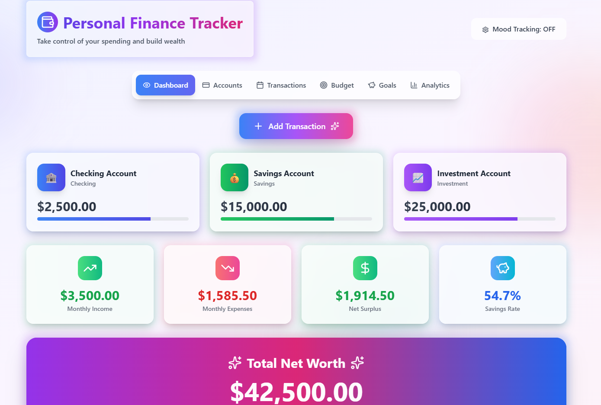

# 💰 Personal Finance Tracker  

Take control of your spending and build wealth with this intuitive finance tracking app.  
The app helps you manage multiple accounts, track transactions, set budgets, monitor goals, and gain insights into your financial health.  



---

## Features  

- **Dashboard Overview** – See balances for Checking, Savings, and Investment accounts in one place.  
- **Account Management** – Track multiple accounts with clear categorisation.  
- **Transactions** – Add, edit, and review transactions to keep your records up to date.  
- **Budgeting Tools** – Set monthly budgets and monitor progress.  
- **Goals Tracking** – Define financial goals (e.g., saving for a trip) and track progress visually.  
- **Analytics** – View spending insights and patterns with charts.  

---

## Tech Stack  

- **Frontend:** React, TypeScript, TailwindCSS  
- **State Management:** React Context  
- **Backend:** Node.js, Express.js, Knex, SQLite (dev) / PostgreSQL (prod-ready)  

<!-- - **Data Visualisation:** Recharts / Chart.js   -->

---

## Project Structure  

```bash
personal-finance-tracker/
│── client/                  # Frontend React app
│   ├── src/
│   │   ├── components/      # UI components (Accounts, Transactions, etc.)
│   │   ├── utils/           # Helper functions
│   │   │   ├── constants.ts
│   │   │   └── types.ts
│   │   ├── styles/          # Global styles
│   │   ├── index.tsx        # Entry point
│   │   └── router.tsx       # Routing setup
│   └── package.json
│
│── server/                  # Backend API (Express + Knex)
│   ├── db/                  
│   │   ├── migrations/      # Database migrations
│   │   ├── accounts.ts      # DB queries for accounts
│   │   ├── transactions.ts  # DB queries for transactions
│   │   └── connection.ts    # Knex connection setup
│   │
│   ├── routes/              # API routes
│   │   ├── accounts.ts
│   │   └── transactions.ts
│   │
│   ├── app.ts               # Express app config
│   ├── index.ts             # Entry point
│   └── server.ts            # Server bootstrap
│
├── .env                     # Environment variables
└── README.md
```
---

## Future Improvements  

Things I’m currently working on and planning to add:  

- **Budget View Enhancements** – more detailed breakdown of categories and monthly progress.  
- **Goals View** – ability to set financial goals (e.g., travel fund, emergency savings) and track progress visually.  
- **Export & Import Data** – save reports to CSV or PDF for offline tracking.  
- **Mood Tracking** – Connect emotional awareness to your financial decisions.
- **Authentication:** Auth0 / JWT  

**Project Purpose**  
This application was developed as a **study project** during my full-stack web development training.  
The goal is to practice building a complete full-stack application using **React, TypeScript, Node.js, Express, Knex, and SQLite/PostgreSQL**, while applying concepts like authentication, state management, and database integration.  
